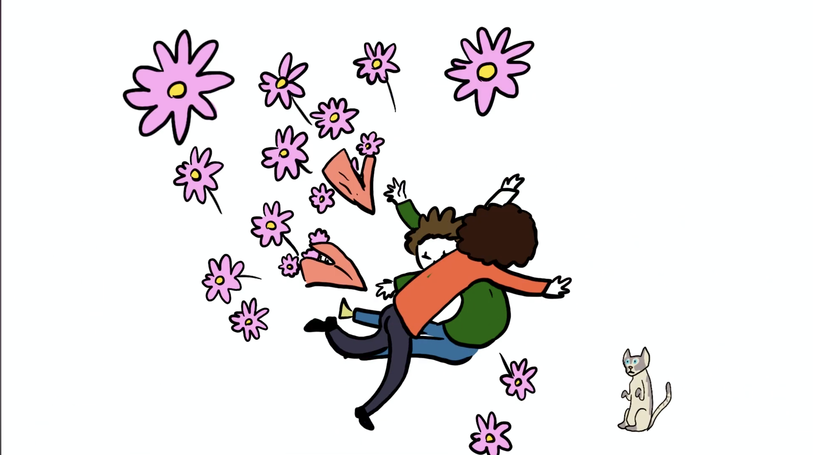

# Animations
I grew up cartoon obsessed and always wanted to make my own. So here are a few.

## A Late Night Drive

- I made this one for a college project based on a comic-strip I made inspired by Creepshow and anthology horror stories.

- HEADPHONE WARNING--sorry!

- The theme for this project was "multi-media" so I made this with Adobe After-Effects, Photoshop, and Procreate.

## Birthday Bab

- This was a birthday gift for my girlfriend, Abbie. 
- She is a real-life cartoon character, so it felt fitting for her to have her own show.
